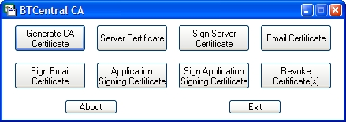



## OLD VERSION \- BTCentral Certificate Authority \(CA\)/SSL Certificate Maker

### Description

This is the OLD version - please download the new version from:

http://www.pscode.com/vb/scripts/ShowCode.asp?txtCodeId=59827&lngWId=1

This program is a GUI for openSSL, it lets you set-up your own CA and is totally free, it does all the hardwork - creates the configuration files, sends the commands etc. all you have to do is fill in a few fields... it's never been easier to set-up your own CA or make SSL/Email/Software Signing certificates! Make sure you download openSSL from: http://www.slproweb.com/products/Win32OpenSSL.html and copy openSSL.exe and any of it's required DLL files to the folder CA.exe is in before use!
 
### More Info
 

             |
---                |---
**Submitted On**   |2005-03-07 19:13:48
**By**             |[BTCentral \(Ben Thomas\)](https://github.com/Planet-Source-Code/PSCIndex/blob/master/ByAuthor/btcentral-ben-thomas.md)
**Level**          |Advanced
**User Rating**    |5.0 (30 globes from 6 users)
**Compatibility**  |VB 6\.0
**Category**       |[Internet/ HTML](https://github.com/Planet-Source-Code/PSCIndex/blob/master/ByCategory/internet-html__1-34.md)
**World**          |[Visual Basic](https://github.com/Planet-Source-Code/PSCIndex/blob/master/ByWorld/visual-basic.md)
**Archive File**   |[Ceritifica186212372005\.zip](https://github.com/Planet-Source-Code/btcentral-ben-thomas-old-version-btcentral-certificate-authority-ca-ssl-certificate-maker__1-59367/archive/master.zip)

